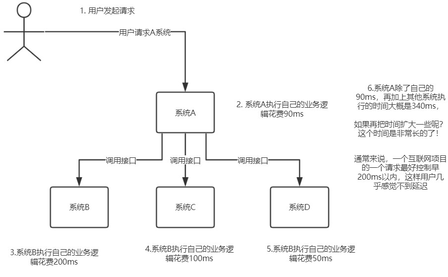
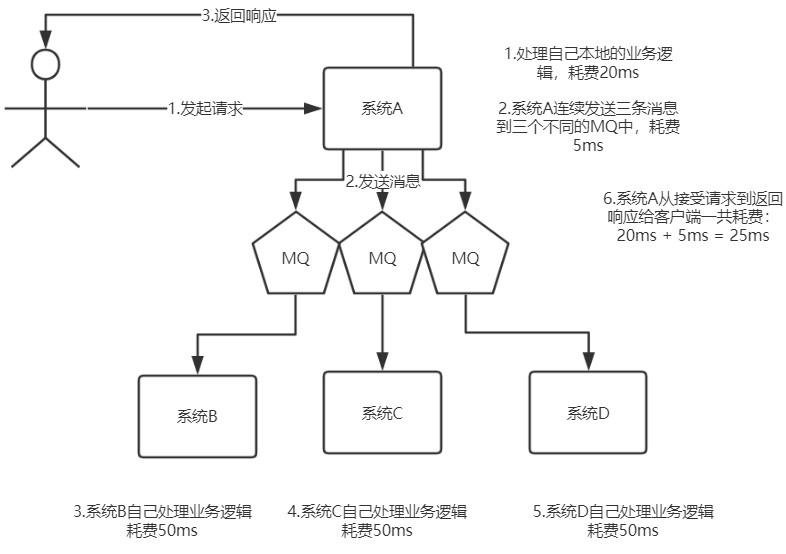
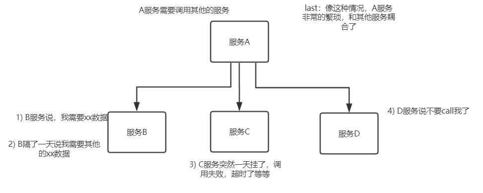
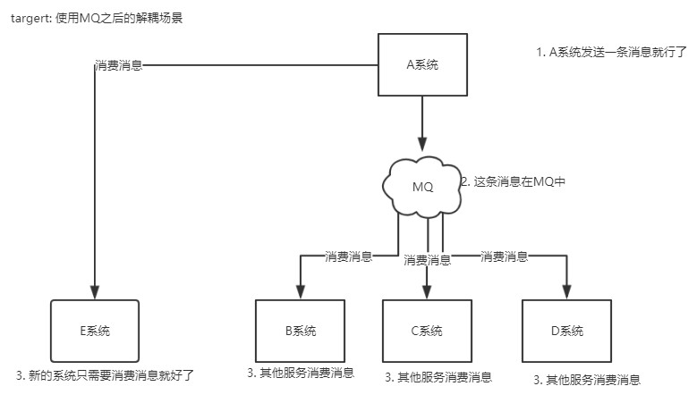
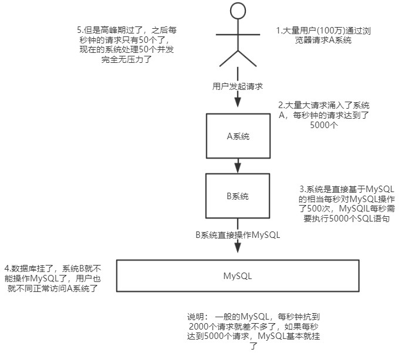
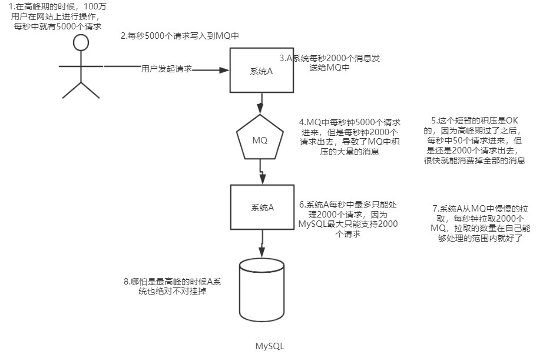

# 什么是同步

首先，我们想到，在一个复杂的系统中，可用会有多个子系统，这也业务系统之间都是通过接口来进行调用了，例如我们可以使用Spring Cloud的REST来进行调用，也可以使用Dubbo来进行RPC的调用，例如下图：

从上图我们可以看出，同步调用不仅响应的时间长，并且，如果其他系统出现了异常，超时等情况，那么系统A返回给客户端的时间是否会更加的长呢？ 并且也会影响整合执行链路的正常运行

# 依托消息中间件，实现异步

假设，我们现在在系统A和其他系统之间加上一个消息中间件，也称为“Message Queue”消息队列，

# 什么是耦合

我们之前降到了，同步调用，那么A系统调用B系统的时候，如果B系统出现了异常，那么异常会返回给A系统，A系统会把异常给客户端？ 那么A系统是不是需要来对这个异常进行处理，这就是所谓的**耦合**，只要B系统出了故障，就会影响到A系统，A系统必须时常关注B系统抛出的异常，这是非常麻烦的

# 依托消息中间件，实现解耦

假设，我们A系统执行完了自己的业务，发送一条消息给Message Queue中，B系统去拉取这一条消息，这样就算B系统执行自己业务的时候故障了，也不会影响A系统

# 消息中间件是用来干什么的？

首先，消息中间件本身就是自己独立部署的，他的作用就是用来给多个系统“发消息”和”收消息“的，实现了多个系统之间的”异步“调用，而不是仅局限于同步调用，同样可以对比我们的Dubbo同步RPC服务调用，和Spring Cloud的同步REST调用

再通俗一点： 消息中间件就是“微信”， 同步就是两个人面对面聊天，异步就是A给B发微信，然后A就可以干自己的事情了，B接受到A的消息之后，再干自己的事情。

# 消息中间件到底有什么用？

这个用处可多了去了，主要的作用有这么几个，包括**异步化提升性能，降低系统耦合，流量削峰**，等等

# 流量削峰

我们假设A系统是不操作数据库的，可以抗下很高的并发，例如，部署10台A系统，那么轻松抗下了1W的并发，但是B系统是操作数据库的，假设数据库服务器配置是8核心16GB，抗下4000的并发，但是现在是一个请求的高峰期，A系统每秒接受1W的请求，显然如果这1W的请求，同步打在B系统上，B系统部署多台可以抗住，但是数据库是承受不住的

这个时候引入MQ就可以解决这个问题，我们客户端的请求打在A系统上面，然后A系统发送消息到MQ中，然后B系统再从MQ中拉取消息，这时候可以控制B系统拉取消息的数量，例如每秒拉取3000个消息，然后B系统再执行自己的业务，显示这个 时候数据库就能够承受了

所以这就是MQ进行流量削峰的效果，**系统A发送过来的每秒5000请求是一个流量洪峰，然后MQ直接给扛下来了，都存储自己本地磁盘**，这个过程就是流量削峰的过程，瞬间把一个洪峰给削下来了，让系统B后续慢慢获取消息来处理。