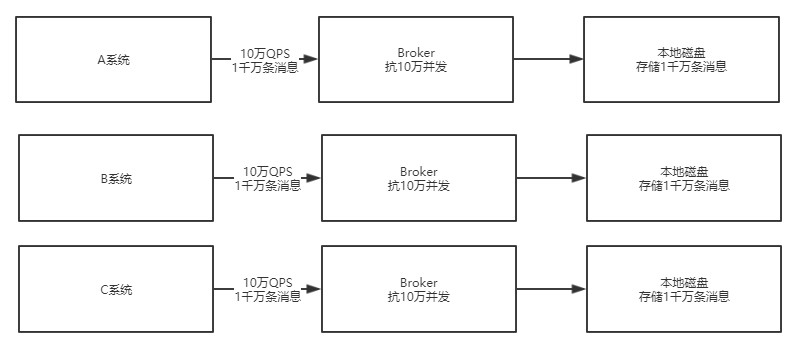

# 选择RokcetMQ的理由

似乎RabbitMQ足以应对一般的需求了，但是假设未来系统需要承载海量并发呢？也许我们也会有每秒几十万的QPS，也许我们以后也需要对MQ进行源码的二次开发，那此时RabbitMQ还合适吗？

所以，选择RokcetMQ作为技术选型

# 问题 / 关注点

- RocketMQ如何集群化部署承载高并发的？
- 如果RokcetMQ中要存储海量的消息，如何实现分布式存储架构?

# RocketMQ如何集群化部署还支撑高并发？

首先说第一个问题, MQ如何集群化部署还支撑高并发

这里先说一下概念，假设RokcetMQ部署在一台机器上，即使这台机器的配置很高，但是一般来说一台机器也就是支撑10万+的并发访问

那么这个时候，假设有大量的系统都要往RocketMQ里高并发的写入消息，可能达到每秒有几十万请求，这个时候怎么办呢？

没关系，RocketMQ是可以集群化部署的，可以部署在多台机器上，假设每台机器都能抗10万并发，然后你只要让几十万请求分散到多台机器上就可以了，让每台机器承受的QPS不超过10万不就行了。

这其实就是RocketMQ集群化部署抗下高并发的主要原理，当然，具体怎么做才能让系统的流量分散在RocketMQ部署的多台机器上

# RocketMQ要存储海量消息怎么做

现在来说第二个问题，一般来说多个系统会向MQ中发送消息，此时MQ会存储大量的消息，但是这些消息并不是马上就会被消费方进行消费，所以一般MQ都会把消息在自己本地磁盘存储起来，然后等待消费方去处理

既然如此，MQ就得存储大量的消息，可能是几百万条，可能几亿条，甚至万亿条，这么多的消息在一台机器上肯定是没法存储的，RocketMQ是如何分布式存储海量消息的呢？

延上面的图，其实发送消息到MQ系统会把消息发送给多个不同的机器，假设共有1万条消息，分散发送给10台机器，可能每台机器就接收到1千条消息

其次，每台机器上**部署的RocketMQ进程一般称之为Broker**，每个Broker都会收到不同的消息，然后就会把这批消息存储在自己本地的磁盘文件里

这样的话，假设你有1亿条消息，然后有10台机器部署了RocketMQ的Broker，理论上不就可以让每台机器存储1000万条消息了吗？

所以本质上RocketMQ存储海量消息的机制就是**分布式的存储**

所谓分布式存储，就是把数据分散在多台机器上来存储，每台机器存储一部分消息，这样多台机器加起来就可以存储海量消息了！

# 高可用保障，Broker挂了怎么办

上面我们多个Broker，分布式存储消息的架构很理想化

要是任何一台Broker突然宕机了怎么办？那不就会导致RocketMQ里一部分的消息就没了吗？这就会导致MQ的不可靠和不可用，这个问题怎么解决？

RokcetMQ的思路是**Broker主从架构以及多副本策略**

简单来说，Broker是有Master和Slave两种角色的

Master Broker收到消息之后会同步给Slave Broker，这样Slave Broker上就能有一模一样的一份副本数据！

这样同一条消息在RocketMQ整个集群里不就有两个副本了，一个在Master Broker里，一个在Slave Broker里！

这个时候如果任何一个Master Broker出现故障，还有一个Slave Broker上有一份数据副本，可以保证数据不丢失，还能继续对外提供服务，保证了MQ的可靠性和高可用性

# 数据路由，怎么知道访问那个Broker

现在又有一个问题了，对于系统来说，要发送消息到MQ里去，还要从MQ里消费消息

那么大家怎么知道有哪些Broker？怎么知道要连接到哪一台Broker上去发送和接收消息？这是一个大问题！

所以RocketMQ为了解决这个问题，有一个**NameServer**的概念，他也是独立部署在几台机器上的，然后所有的Broker都会把自己注册到NameServer上去，NameServer不就知道集群里有哪些Broker了？

这是不是类似微服务架构中的服务注册中心呢？

然后对于我们的系统而言，如果他要发送消息到Broker，会找NameServer去获取路由信息，就是集群里有哪些Broker等信息

如果系统要从Broker获取消息，也会找NameServer获取路由信息，去找到对应的Broker获取消息。

# 后续问题

- 大的架构原理是知道了，但是发送消息的时候面对N多台机器，到底应该向哪一台上面的Broker发送过去？

- RocketMQ的数据模型是什么，我们发送消息过去的时候，是发送到什么里面去，队列还是什么？

- RocketMQ接收到数据之后是直接写磁盘吗，那性能会不会太差了？

