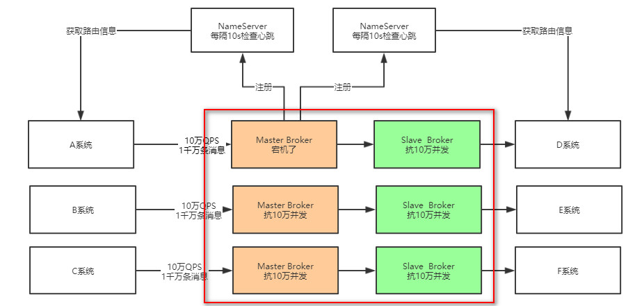
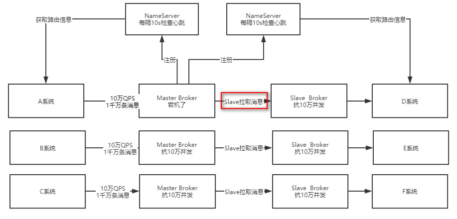
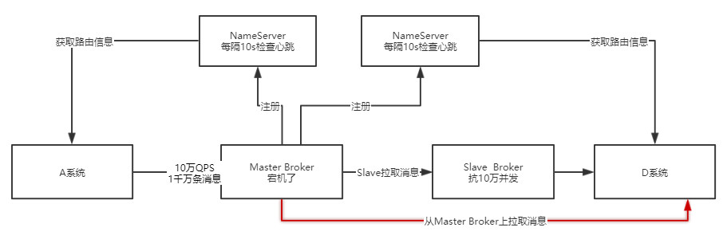
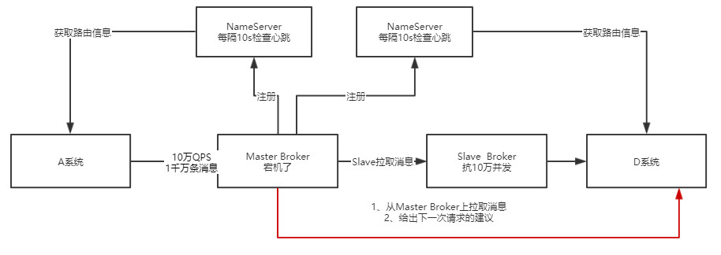
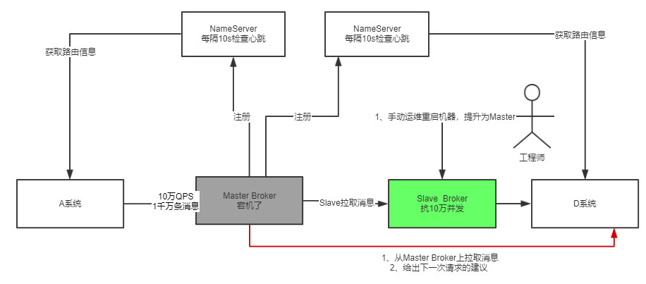
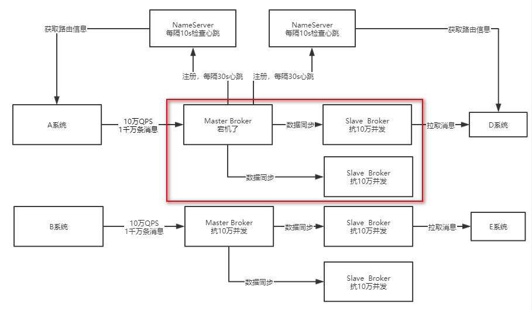
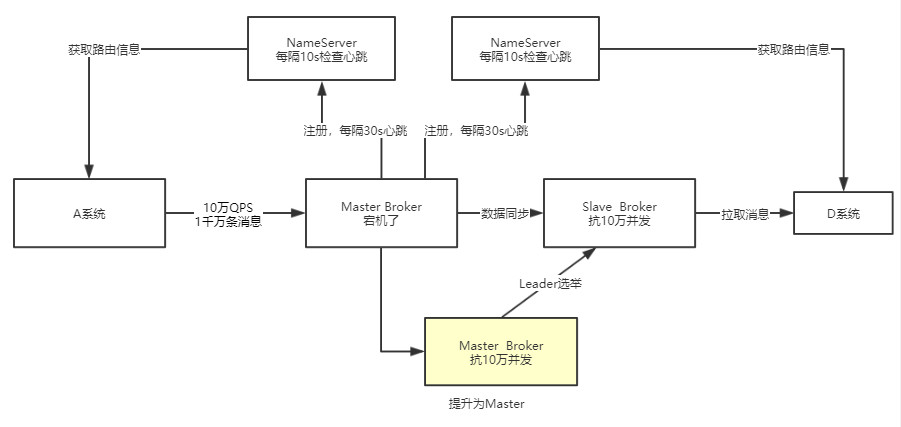

# Broker是什么？

消息中间件最终的实现就是Broker，可以说一个Broker就是一个消息中间件的实例

# Master Broker是如何将消息同步给Slave Broker的？

首先第一个问题，我们都知道，为了保证消息中间件的高可用，我们通常的部署方案都是部署Master-Slave的模式的，也就是一个Master Broker对应一个Slave Broker

然后在Master Broker接受到消息之后，也会同步一份数据给Salve Broker，这样就算Master Broker挂了，Slave Broker上也有一份相同的数据

所以，在这里首先考虑一个问题？ Master是如何将消息同步给Slave的呢？

是Maste Broker主动给Slave Broker推送的呢？还是Slave Broker主动发送请求从Master Broker**拉取**的呢？	

答案是第二种：**RocketMQ的Mster-Slave架构模式是Slave Broker主从发送请求给Master Broker拉取消息，也就是Pull模式**

# RockerMQ实现读写分离了吗？

下一个问题，既然Master Broker主要是接收系统的消息写入，然后会同步给Slave Broker，那么其实本质上Slave Broker也应该有一份一样的数据

所以这里提出一个疑问，作为消费者的系统在获取消息的时候，是从Master Broker获取的？还是从Slave Broker获取的？

其实都不是，**答案是：既有可能从Master Broker获取消息，也有可能从Slave Broker获取消息**

作为消费者系统，在获取消息的时候会先发请求到Master Broker上，请求获取一批消息，此时Master Broker是会返回一批消息给消费者系统的

**然后，Master Broker在返回这批消息的时候，会根据当时Master Broker的负载 情况以及和Slave Broker同步的情况向消费者系统建议下一次请求是从Master Broker上拉取还是从Salve Broker上拉取**

举个例子，要是这个时候Master Broker负载很重，本身要抗10万写并发了，你还要从他这里拉取消息，给他加重负担，那肯定是不合适的。

所以此时Master Broker就会建议你从Slave Broke去拉取消息。

或者举另外一个例子，本身这个时候Master Broker上都已经写入了100万条数据了，结果Slave Broke不知道啥原因，同步的特别慢，才同步了96万条数据，落后了整整4万条消息的同步，这个时候你作为消费者系统可能都获取到96万条数据了，那么下次还是只能从Master Broker去拉取消息。

因为Slave Broker同步太慢了，导致你没法从他那里获取更新的消息了。

这一切都是根据Master Broker的情况来决定的

**所以，在写消息的时候，通常是会去找Master Broker写消息的**

但是在拉取消息的时候，有可能从Master Broker获取，也可能从Slave Broker去获取，一切都根据当时的情况来定。

# 如果Salve Broker挂了会有什么影响？

有一点影响，但是影响不大。

因为写入消息全部是走Master Broker的，然后获取消息也是可以走Master Broker的， 只不过有一些消息获取可能走Slave Broker

所以如果Slave Broker挂了，那么此时无论消息写入还是消息拉取，还是可以继续从Master Broke去走，对整体运行不影响。

只不过少了Slave Broker，会导致所有读写压力都集中在Master Broker上

# 如果Master Broker挂了该怎么办？

假设出现一个故障，Master Broker挂了，这样会出现什么情况？

这个时候对写入消息和读取消息都是由一定影响的，但是其本质而言，Slave Broker机器上也有一份相同的数据，只是可能出现了少量的消息丢失，在Master Broker还没来得及同步给Slave Broker的时候就挂了

---

但是此时RokectMQ可以自动将Slave Broker切换为Master Broker吗？

答案： 不能

---

在RocketMQ 4.5版本之前，都是用Slave Broker同步数据，尽量保证数据不丢失，但是一旦Master故障了，Slave是没法自动切换成Master的。

所以在这种情况下，如果Master Broker宕机了，这时就得手动做一些运维操作，把Slave Broker重新修改一些配置，重启机器给调整为Master Broker，这是有点麻烦的，而且会导致中间一段时间不可用。

**所以这种Master-Slave模式不是彻底的高可用模式，他没法实现自动把Slave切换为Master**

# 基于 Deldger实现RokcetMQ高可用自动切换

在RocketMQ 4.5之后，这种情况得到了改变，因为RocketMQ支持了一种新的机制，叫做Dledger

这个东西本身是基于Raft协议实现的一个机制，实现原理和算法相当复杂

简单来说，把Deldger融入RocketMQ之后，就可以让一个Master Broker应对多个Slave Broker，也就是说一个数据可以有多份副本，比如一个Master Broker应对两个Slave Broker

然后会在Master和Slave之间进行数据同步

此时，一旦Master Broker宕机了，就可以在多个副本，也就是多个Slave，通过Deldger技术和Raft协议算法，直接在Salve Broker中选举一个为新的Master Broker，然后这个新的Master Broker就可以对外提供服务了

所以, 我们在设计RocketMQ生产部署架构的时候，完全可以采用基于Dledger的部署方式，这样可以让RocketMQ做到自动故障切换了！

