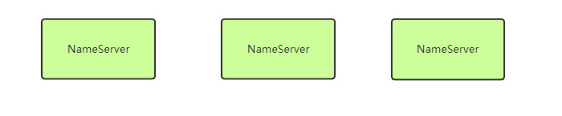
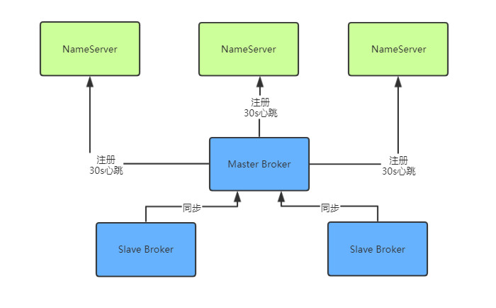
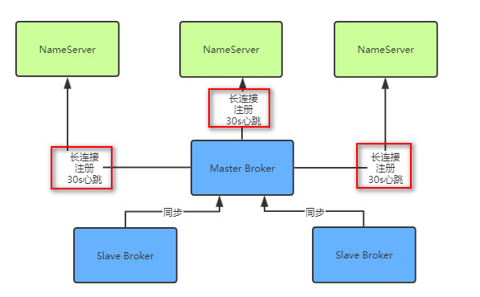
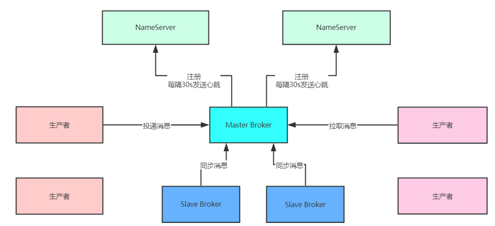
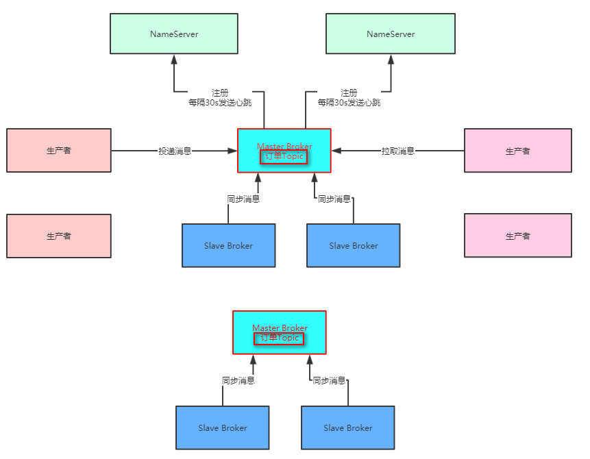
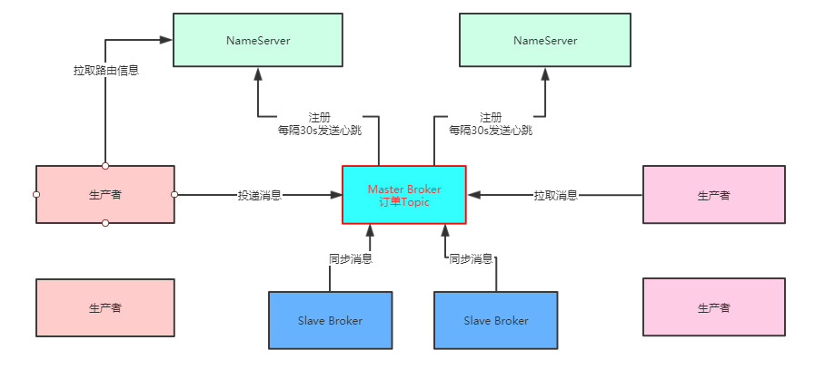
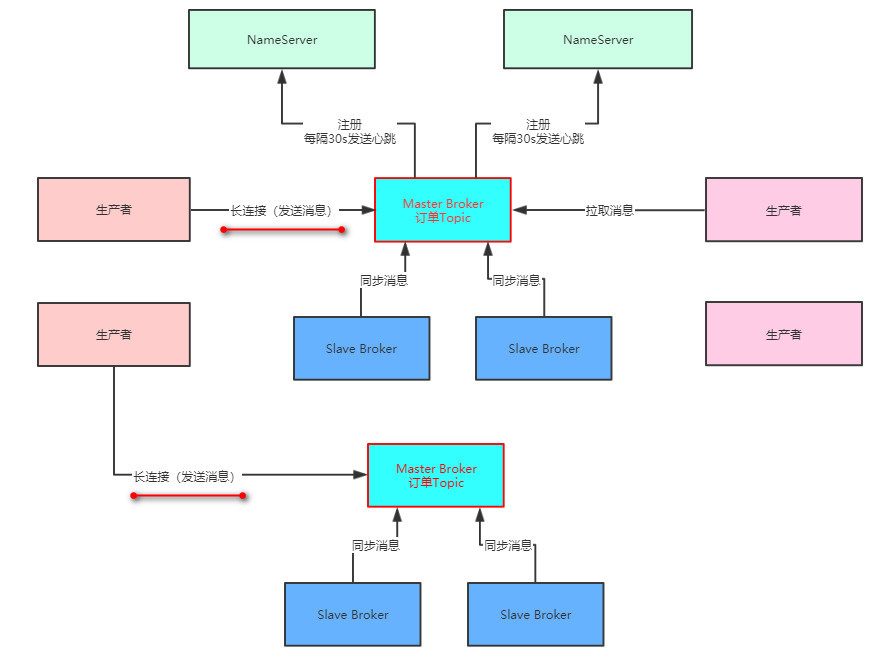
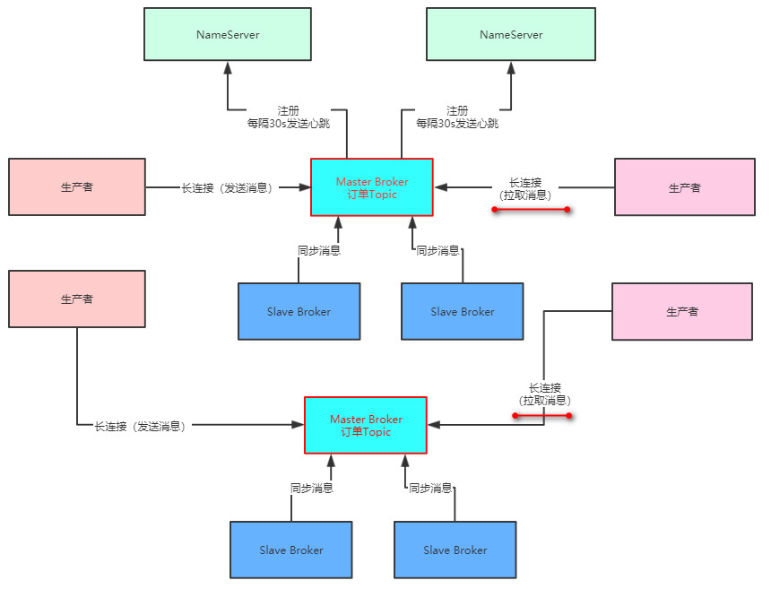

# NameServer集群化部署，保证高可用

首先第一步，我们要让NameServer集群化部署，建议可以部署在三台机器上，这样可以充分保证NameServer作为路由中心的可用性，哪怕是挂掉两台机器，只要有一个NameServer还在运行，就能保证MQ系统的稳定性。



NameServer的设计是采用的Peer-to-Peer的模式来做的，也就是可以集群化部署，但是里面任何一台机器都是独立运行的，跟其他的机器没有任何通信。


每台NameServer实际上都会有完整的集群路由信息，包括所有的Broker节点信息，我们的数据信息，等等。所以只要任何一台NameServer存活下来，就可以保证MQ系统正常运行，不会出现故障。


因此NameServer的集群化部署是必须的第一步

# 部署单机NameServer和单机Broker


下载源码

 ```shell
wget https://archive.apache.org/dist/rocketmq/4.4.0/rocketmq-all-4.4.0-source-release.zip
 ```


编译和打包

```shell
unzip rocketmq-all-4.4.0-source-release.zip
cd rocketmq-all-4.4.0/
mvn -Prelease-all -DskipTests clean install -U
cd distribution/target/apache-rocketmq
```


```shell
JAVA_OPT="${JAVA_OPT} -server -Xms128m -Xmx128m -Xmn128m
```


启动NameServer

```shell
nohup sh bin/mqnamesrv  &
```


生成broker配置文件，不然默认是阿里的服务器，客户端访问不到

```shell
mkdir conf/me-2m-2s-async
sh mqbroker -m >../conf/me-2m-2s-async/broker.p
```


```shell
# 仅仅这2行, 删除默认的其他配置
brokerIP1=39.106.108.194
autoCreateTopicEnable=true
```

启动Broker

```shell
nohup sh bin/mqbroker -n localhost:9876 -c conf/me-2m-async/broker.p  &
```


# 基于Dledger的Broker主从架构技术

其次，就是要考虑我们的Broker集群应该如何部署，采用什么方式来部署。

如果采用RocketMQ 4.5以前的那种普通的Master-Slave架构来部署，能在一定程度上保证数据不丢失，也能保证一定的可用性。

但是那种方式的缺陷是很明显的，最大的问题就是当Master Broker挂了之后，没办法让Slave Broker自动切换为新的Master Broker，需要手工做一些运维操作，修改配置以及重启机器才行，这个非常麻烦。

在手工运维的期间，可能就会导致系统的不可用。

所以既然现在RocketMQ 4.5之后已经基于Dledger技术实现了可以自动让Slave切换为Master的功能，那么我们肯定是选择基于Dledger的主备自动切换的功能来进行生产架构的部署。

而且Dledger技术是要求至少得是一个Master带两个Slave，这样有三个Broke组成一个Group，也就是作为一个分组来运行。一旦Master宕机，他就可以从剩余的两个Slave中选举出来一个新的Master对外提供服务。



**在上图可以看到，每个Broker（不论是Master和Slave）都会把自己注册到所有的NameServer上去。**


**注：图中没有画出Slave Broker注册到NameServer。**


然后Master Broker还会把数据同步给两个Slave Broker，保证一份数据在不同机器上有多份副本。


# Broker是如何跟NameServer通信的


之前我们的时候就说过，这个Broker会每隔30秒发送心跳到所有的NameServer上去，然后每个NameServer都会每隔10s检查一次有没有哪个Broker超过120s没发送心跳的，如果有，就认为那个Broker已经宕机了，从路由信息里要摘除这个Broker。


**首先，Broker跟NameServer之间的通信是基于什么协议来进行的？**


HTTP协议？RPC调用？还是TCP长连接？首先我们要搞明白这个。


在RocketMQ的实现中，采用的是**TCP长连接**进行通信。


也就是说，Broker会跟每个NameServer都建立一个TCP长连接，然后定时通过TCP长连接发送心跳请求过去




所以各个NameServer就是通过跟Broker建立好的长连接不断收到心跳包，然后定时检查Broker有没有120s都没发送心跳包，来判定集群里各个Broker到底挂掉了没有。


# 使用MQ的系统要多机器集群化部署

下一步，我们一定会有很多的系统使用RocketMQ，有些系统是作为生产者往MQ发送消息，有些系统是作为消费者从MQ获取消息，当然还有的系统是既作为生产者，又作为消费者，所以我们要考虑这些系统的部署。


对于这些系统的部署本身不应该在MQ的考虑范围内，但是我们还是应该给出一个建议，就是无论作为生产者还是消费者的系统，都应该多机器集群化部署，保证他自己本身作为生产者或者消费者的高可用性


因为一个系统如果就部署在一台机器上，然后作为生产者向MQ发送消息，那么一旦哪天机器上的生产者系统挂了，整个流程就断开了，不能保证高可用性。


但是如果在多台机器上部署生产者系统，任何一台机器上的生产者挂了，其他机器上的生产者系统可以继续运行。


生产者消费者集群化部署图



上述所说在图里可以清晰看到，同理消费者系统也是集群化部署的，如果一台机器上的消费者系统挂了，其他机器上的消费者系统应该是可以继续运行的。


# MQ的核心数据模型，Topic是什么？

生产者和消费者都会向MQ中写消息和 获取消息，但是有一个问题？


MQ中的数据模型是什么？生产者投递出去的消息到底逻辑上是放在那里的？是队列吗？还是其他的？


**MQ中的核心数据模型就是Topic**


Topic翻译为中文大致就是“主题”的意思，其实Topic就是**数据集合**的意思


举个例子，比如你的订单系统现在向MQ中发送订单消息，那么此时你就可以创建一个Topic，它的名字应该叫topic_order_info, 也就是一个包含了订单消息的数据集合


**一句话， Topic其实就是数据集合的意思，不同的数据类型你得放到不同的Topic中去**


要是你有一些商品的数据要放入到MQ中去，那么你就需要创建一个名为topic_product_info的Topic数据集合，然后这个商品Topic只存放和商品数据有关的消息


所以简单来说，你的系统要向MQ中投递或者获取消息，那么首先你需要创建一些Topic，作为数据集合存放不同类型的数据，比如说商品Topic，订单Topic


# Topic作为数据集合是怎么在Borker集群中存储的呢？

下一个问题： 我们创建的那些Topic，是怎么存储在Broker集群中的呢？

这里就体现了一个**分布式存储**的概念了


首先我们来想一下，比如我们有一个订单Topic，可能订单系统每天都会往里面投递几百万条数据，然后这些数据在MQ集群上还得保留好多天，那么最终可能会有几千万的数据量，这还只是一个Topic。

那么如果有很多的Topic，并且里面都有大量的数据，最终加起来的总和也许是一个惊人的数字，此时这么大量的数据本身是不太可能存放在一台机器上的。


如果一台机器没法放下那么多的数据，应该怎么办呢？

很简单，分布式存储

我们可以在创建Topic的时候指定让他里面的数据分散存储在多台Broker机器上，比如一个Topic里有1000万条数据，此时有2台Broker，那么就可以让每台Broker上都放500万条数据。

这样就可以把一个Topic代表的数据集合分布式存储在多台机器上了。

如下图所示：



而且另外很重要的一件事是，每个Broke在进行定时的心跳汇报给NameServer的时候，都会告诉NameServer自己当前的数据情况，比如有哪些Topic的哪些数据在自己这里，这些信息都是属于路由信息的一部分

Broker心跳的时候会汇报给NameServer自己的数据情况，这样每个NameServer都知道集群里有哪些Broker，每个Broker存放了哪些Topic的数据。

# 生产者系统是如何将消息发送给Broker的？

接着是下一个问题：生产者系统是如何将消息发送到Broker的呢？

首先我们之前说过，在发送消息之前，得先有一个Topic，然后在发送消息的时候你得指定你要发送到哪个Topic里面去。

接着既然你知道你要发送的Topic，那么就可以跟NameServer建立一个TCP长连接，然后定时从他那里拉取到最新的路由信息，包括集群里有哪些Broker，集群里有哪些Topic，每个Topic都存储在哪些Broker上。



然后生产者系统自然就可以通过路由信息找到自己要投递消息的Topic分布在哪几台Broker上，此时可以根据负载均衡算法，从里面选择一台Broke机器出来，比如round robine轮询算法，或者是hash算法，都可以。

总之，选择一台Broker之后，就可以跟那个Broker也建立一个TCP长连接，然后通过长连接向Broker发送消息即可.


Broker收到消息之后就会存储在自己本地磁盘里去。



这里唯一要注意的一点，就是生产者一定是投递消息到Master Broker的，然后Master Broker会同步数据给他的Slave Brokers，实现一份数据多份副本，保证Master故障的时候数据不丢失，而且可以自动把Slave切换为Master提供服务

# 消费者是如何从Broker拉取消息的？

消费者系统其实跟生产者系统原理是类似的，他们也会跟NameServer建立长连接，然后拉取路由信息，接着找到自己要获取消息的Topic在哪几台Broker上，就可以跟Broker建立长连接，从里面拉取消息了。



这里唯一要注意的一点是，消费者系统可能会从Master Broker拉取消息，也可能从Slave Broker拉取消息，都有可能，一切都看具体情况。


# 整体架构: 高可用、高并发、海量消息、可伸缩

整个这套生产架构是实现完全高可用的，因为NameServer随便一台机器挂了都不怕，他是集群化部署的，每台机器都有完整的路由信息；

Broker随便挂了一台机器也不怕，挂了Slave对集群没太大影响，挂了Master也会基于Dledger技术实现自动Slave切换为Master；

生产者系统和消费者系统随便挂了一台都不怕，因为他们都是集群化部署的，其他机器会接管工作。

而且这个架构可以抗下高并发，因为假设订单系统对订单Topic要发起每秒10万QPS的写入，那么只要订单Topic分散在比如5台Broker上，实际上每个Broker会承载2万QPS写入，也就是说高并发场景下的10万QPS可以分散到多台Broker上抗下来。

然后集群足以存储海量消息，因为所有数据都是分布式存储的，每个Topic的数据都是存储在多台Broker机器上的，用集群里多台Master Broker就足以存储海量的消息。

所以，用多个Master Broker部署的方式，加上Topic分散在多台Broker上的机制，可以抗下高并发访问以及海量消息的分布式存储。

然后每个Master Broker有两个Slave Broker结合Dledger技术可以实现故障时的自动Slave-Master切换，实现高可用性。

最后，这套架构还具备伸缩性，就是说如果要抗更高的并发，存储跟多的数据，完全可以在集群里加入更多的Broker机器，这样就可以线性扩展集群了。