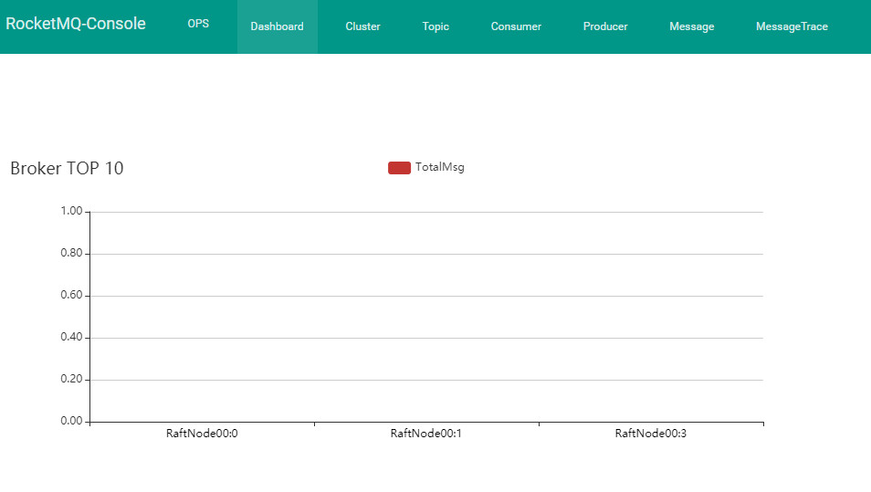

# 可视化管理界面

## 部署步骤

```shell
git clone https://github.com/apache/rocketmq-externals.git
```

然后进入rocketmq-console的目录：

```shell
cd rocketmq-externals/rocketmq-console
```

执行以下命令对rocketmq-cosole进行打包，把他做成一个jar包：

```shell
mvn package -DskipTests
```

然后进入target目录下，可以看到一个jar包，接着执行下面的命令启动工作台：

```shell
nohup java -jar rocketmq-console-ng-1.0.1.jar --server.port=8080 --rocketmq.config.namesrvAddr=127.0.0.1:9876 &
```

这里务必要在启动的时候设置好NameServer的地址，如果有多个地址可以用分号隔开，接着就会看到工作台启动了，然后就通过浏览器访问那台机器的8080端口就可以了，就可以看到精美的工作台界面。

# 如何通过工作台进行集群监控

这个可视化的工作台可以说是非常强大的，他几乎满足了我们大部分对RocketMQ集群监控的需求



在这个界面里可以让你看到Broker的大体消息负载，还有各个Topic的消息负载，另外还可以选择日期要看哪一天的监控数据，都可以看到。

点击上边导航栏里的“集群”，就会进入集群的一个监控界面。


# 机器本身的监控应该如何做？

现在有了这个东西，我们是可以在压测的时候看到整个RocketMQ的TPS了，也就是Transaction Per Second，就是每秒事务的意思，在这里就是每秒消息数量的意思。

但是我们要同时看到集群每台机器的CPU、IO、磁盘、内存、JVM GC的负载和情况怎么办呢？

其实这些东西都有很好的监控系统可以去看了，比如说Zabbix、Open-Falcon等等，一般都会用这些东西来监控机器的性能和资源使用率。