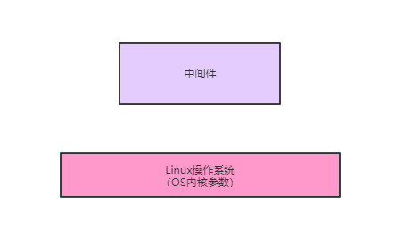
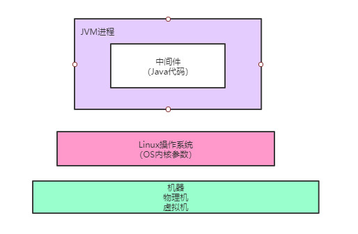

# 架构图


对于生产环境的中间件集群，不能直接用各种默认参数启动，因为那样可能有很多问题，或者没法把中间件的性能发挥出来。

对于一个中间件而言，第一步，你需要对他部署的机器的OS内核参数进行一定的调整（也就是linux操作系统的一些内核参数）

因为OS内核参数很多默认值未必适合生产环境的系统运行，有些参数的值需要调整大一些，才能让中间件发挥出来性能，我们看下面的的图。



接着下一步需要思考的一个问题，就是一般中间件，比如RocketMQ、MyCat、Elasticsearch、Kafka之类的东西，很多都是Java开发的，或者是基于JVM的Scala开发的（比如Kafka）

所以你可以认为在一台机器上部署和启动一个中间件系统，说白了就是启动一个JVM进程，由这个JVM进程来运行中间件系统内的所有代码，然后实现中间件系统的各种功能。



所以其实对于一个生产环境的中间件系统而言，在部署和启动之前，需要关注的第二个东西就是JVM的各种参数

比如内存区域的大小分配，垃圾回收器以及对应的行为参数，GC日志存放地址，OOM自动导出内存快照的配置，等等。

所以你就需要对JVM进行合理的优化配置，比如最简单的一点，明明你部署了一个几十GB内存的高配置物理机，结果你就给中间件系统的JVM分配了1GB的内存，你觉得这是不是在开玩笑？

相当于你机器配置很高，结果你的中间件系统就用了里面的几十分之一的内存，根本没用上那么多的资源！


中间件系统自己本身的一些核心参数的设置，比如你的中间件系统会开启很多线程处理请求和工作负载，然后还会进行大量的网络通信，同时会进行大量的磁盘IO类的操作。


这个时候你就需要依据你的机器配置，合理的对中间件系统的核心参数进行调整

比如你的机器配置很高，是24核CPU，结果你的中间件系统默认就开启了4个工作线程去处理请求，这不是在开玩笑么！相当于24核CPU里很多都是空闲状态，是没有任何事情可以干的。


要是不进行合理的参数设置，几乎可以认为就是在浪费高配置的机器资源！


所以以上三点，就是对任何一个中间件系统，在进行压力测试以及生产环境部署之前，都必须要进行调整的！

当然如果是普通的那种Java Web业务系统，通常而言上线之前主要关注的就是JVM的参数而已，对os内核参数以及业务系统自身参数大多数情况下都没有太多的要求


但是中间件系统而言，往往必须要对**os内核参数、jvm参数以及自身核心参数**都做出相对应的合理的调整，再进行压测和上线。


# RockeMQ集群进行OS内核参数调整


## vm.overcommit_memory

“vm.overcommit_memory”这个参数有三个值可以选择，0、1、2。


如果值是0的话，在你的中间件系统申请内存的时候，os内核会检查可用内存是否足够，如果足够的话就分配内存给你，如果感觉剩余内存不是太够了，干脆就拒绝你的申请，导致你申请内存失败，进而导致中间件系统异常出错。


因此一般需要将这个参数的值调整为1，意思是把所有可用的物理内存都允许分配给你，只要有内存就给你来用，这样可以避免申请内存失败的问题。


比如我们曾经线上环境部署的Redis就因为这个参数是0，导致在save数据快照到磁盘文件的时候，需要申请大内存的时候被拒绝了，进而导致了异常报错。


可以用如下命令修改：`echo 'vm.overcommit_memory=1' >> /etc/sysctl.conf`


## vm.max_map_count

这个参数的值会影响中间件系统可以开启的线程的数量，同样也是非常重要的


如果这个参数过小，有的时候可能会导致有些中间件无法开启足够的线程，进而导致报错，甚至中间件系统挂掉。


他的默认值是65536，但是这个值有时候是不够的，比如我们大数据团队的生产环境部署的Kafka集群曾经有一次就报出过这个异常，说无法开启足够多的线程，直接导致Kafka宕机了。


因此建议可以把这个参数调大10倍，比如655360这样的值，保证中间件可以开启足够多的线程。


可以用如下命令修改：`echo 'vm.max_map_count=655360' >> /etc/sysctl.conf`


## vm.swappiness

这个参数是用来控制进程的swap行为的，这个简单来说就是os会把一部分磁盘空间作为swap区域，然后如果有的进程现在可能不是太活跃，就会被操作系统把进程调整为睡眠状态，把进程中的数据放入磁盘上的swap区域，然后让这个进程把原来占用的内存空间腾出来，交给其他活跃运行的进程来使用。


如果这个参数的值设置为0，意思就是尽量别把任何一个进程放到磁盘swap区域去，尽量大家都用物理内存。


如果这个参数的值是100，那么意思就是尽量把一些进程给放到磁盘swap区域去，内存腾出来给活跃的进程使用。


默认这个参数的值是60，有点偏高了，可能会导致我们的中间件运行不活跃的时候被迫腾出内存空间然后放磁盘swap区域去。


因此通常在生产环境建议把这个参数调整小一些，比如设置为10，尽量用物理内存，别放磁盘swap区域去。


可以用如下命令修改：`echo 'vm.swappiness=10' >> /etc/sysctl.conf`


## ulimit

这个是用来控制linux上的最大文件链接数的，默认值可能是1024，一般肯定是不够的，因为你在大量频繁的读写磁盘文件的时候，或者是进行网络通信的时候，都会跟这个参数有关系


对于一个中间件系统而言肯定是不能使用默认值的，如果你采用默认值，很可能在线上会出现如下错误：error: too many open files。


因此通常建议用如下命令修改这个值：`echo 'ulimit -n 1000000' >> /etc/profile`


## 总结

发现到最后要调整的东西，无非都是跟磁盘文件IO、网络通信、内存管理、线程数量有关系的，因为我们的中间件系统在运行的时候无非就是跟这些打交道。


- 中间件系统肯定要开启大量的线程**（跟vm.max_map_count有关）**
- 而且要进行大量的网络通信和磁盘IO**（跟ulimit有关）**
- 然后大量的使用内存**（跟vm.swappiness和vm.overcommit_memory有关）**


所以对OS内核参数的调整，往往也就是围绕跟中间件系统运行最相关的一些东西。


# 对JVM参数进行调整

在rocketmq/distribution/target/apache-rocketmq/bin目录下，就有对应的启动脚本，比如mqbroker是用来启动Broker的，mqnamesvr是用来启动NameServer的。


用mqbroker来举例，我们查看这个脚本里的内容，最后有如下一行：


`sh ${ROCKETMQ_HOME}/bin/runbroker.sh org.apache.rocketmq.broker.BrokerStartup $@`


这一行内容就是用runbroker.sh脚本来启动一个JVM进程，JVM进程刚开始执行的main类就是org.apache.rocketmq.broker.BrokerStartup


着看runbroker.sh脚本，在里面可以看到如下内容：

```shell
JAVA_OPT="${JAVA_OPT} -server -Xms8g -Xmx8g -Xmn4g"

JAVA_OPT="${JAVA_OPT} -XX:+UseG1GC -XX:G1HeapRegionSize=16m -XX:G1ReservePercent=25 -XX:InitiatingHeapOccupancyPercent=30 -XX:SoftRefLRUPolicyMSPerMB=0"

JAVA_OPT="${JAVA_OPT} -verbose:gc -Xloggc:/dev/shm/mq_gc_%p.log -XX:+PrintGCDetails -XX:+PrintGCDateStamps -XX:+PrintGCApplicationStoppedTime -XX:+PrintAdaptiveSizePolicy"

JAVA_OPT="${JAVA_OPT} -XX:+UseGCLogFileRotation -XX:NumberOfGCLogFiles=5 -XX:GCLogFileSize=30m"

JAVA_OPT="${JAVA_OPT} -XX:-OmitStackTraceInFastThrow"

JAVA_OPT="${JAVA_OPT} -XX:+AlwaysPreTouch"

JAVA_OPT="${JAVA_OPT} -XX:MaxDirectMemorySize=15g"

JAVA_OPT="${JAVA_OPT} -XX:-UseLargePages -XX:-UseBiasedLocking"

JAVA_OPT="${JAVA_OPT} -Djava.ext.dirs=${JAVA_HOME}/jre/lib/ext:${BASE_DIR}/lib"

#JAVA_OPT="${JAVA_OPT} -Xdebug -Xrunjdwp:transport=dt_socket,address=9555,server=y,suspend=n"

JAVA_OPT="${JAVA_OPT} ${JAVA_OPT_EXT}"

JAVA_OPT="${JAVA_OPT} -cp ${CLASSPATH}"
```


在上面的内容中，其实就是在为启动Broker设置对应的JVM参数和其他一些参数

```shell
-server：这个参数就是说用服务器模式启动，这个没什么可说的，现在一般都是如此
```

```shell
-Xms8g -Xmx8g -Xmn4g # 这个就是很关键的一块参数了，也是重点需要调整的
```

```shell
-XX:+UseG1GC -XX:G1HeapRegionSize=16m # 这几个参数也是至关重要的，这是选用了G1垃圾回收器来做分代回收，对新生代和老年代都是用G1来回收

这里把G1的region大小设置为了16m，这个因为机器内存比较多，所以region大小可以调大一些给到16m，不然用2m的region，会导致region数量过多的
```

```shell
-XX:G1ReservePercent=25 # 这个参数是说，在G1管理的老年代里预留25%的空闲内存，保证新生代对象晋升到老年代的时候有足够空间，避免老年代内存都满了，新生代有对象要进入老年代没有充足内存了,默认值是10%，略微偏少，这里RocketMQ给调大了一些
```

```shell
-XX:InitiatingHeapOccupancyPercent=30 # 这个参数是说，当堆内存的使用率达到30%之后就会自动启动G1的并发垃圾回收，开始尝试回收一些垃圾对象,默认值是45%，这里调低了一些，也就是提高了GC的频率，但是避免了垃圾对象过多，一次垃圾回收耗时过长的问题
```

```shell
-XX:SoftRefLRUPolicyMSPerMB=100 # 这个参数默认设置为0了，在其实建议这个参数不要设置为0，避免频繁回收一些软引用的Class对象，这里可以调整为比如1000
```

```shell
-verbose:gc -Xloggc:/dev/shm/mq_gc_%p.log -XX:+PrintGCDetails -XX:+PrintGCDateStamps -XX:+PrintGCApplicationStoppedTime -XX:+PrintAdaptiveSizePolicy -XX:+UseGCLogFileRotation -XX:NumberOfGCLogFiles=5 -XX:GCLogFileSize=30m # 这一堆参数都是控制GC日志打印输出的，确定了gc日志文件的地址，要打印哪些详细信息，然后控制每个gc日志文件的大小是30m，最多保留5个gc日志文件。
```

```shell
-XX:-OmitStackTraceInFastThrow # 这个参数是说，有时候JVM会抛弃一些异常堆栈信息，因此这个参数设置之后，就是禁用这个特性，要把完整的异常堆栈信息打印出来
```

```shell
-XX:+AlwaysPreTouch # 这个参数的意思是我们刚开始指定JVM用多少内存，不会真正分配给他，会在实际需要使用的时候再分配给他,所以使用这个参数之后，就是强制让JVM启动的时候直接分配我们指定的内存，不要等到使用内存的时候再分配
```

```shell
-XX:MaxDirectMemorySize=15g # 这是说RocketMQ里大量用了NIO中的direct buffer，这里限定了direct buffer最多申请多少，如果你机器内存比较大，可以适当调大这个值，
```

```shell
-XX:-UseLargePages -XX:-UseBiasedLocking # 这两个参数的意思是禁用大内存页和偏向锁
```


最后我们做一点小的总结，RocketMQ默认的JVM参数是采用了**G1垃圾回收器****，默认堆内存大小是8G**

这个其实完全可以根据大家的机器内存来调整，你可以增大一些也是没有问题的，然后就是一些G1的垃圾回收的行为参数做了调整，这个一般我们不用去动，然后就是对GC日志打印做了设置，这个一般也不用动


其余的就是禁用一些特性，开启一些特性，这些都直接维持RocketMQ的默认值即可。


# 对RocketMQ核心参数做调整

dledger的示例配置文件：rocketmq/distribution/target/apache-rocketmq/conf/dledger

在这里主要是有一个较为核心的参数：`sendMessageThreadPoolNums=16`

这个参数的意思就是RocketMQ内部用来发送消息的线程池的线程数量，默认是16

其实这个参数可以根据你的机器的CPU核数进行适当增加，比如机器CPU是24核的，可以增加这个线程数量到24或者30，都是可以的。

