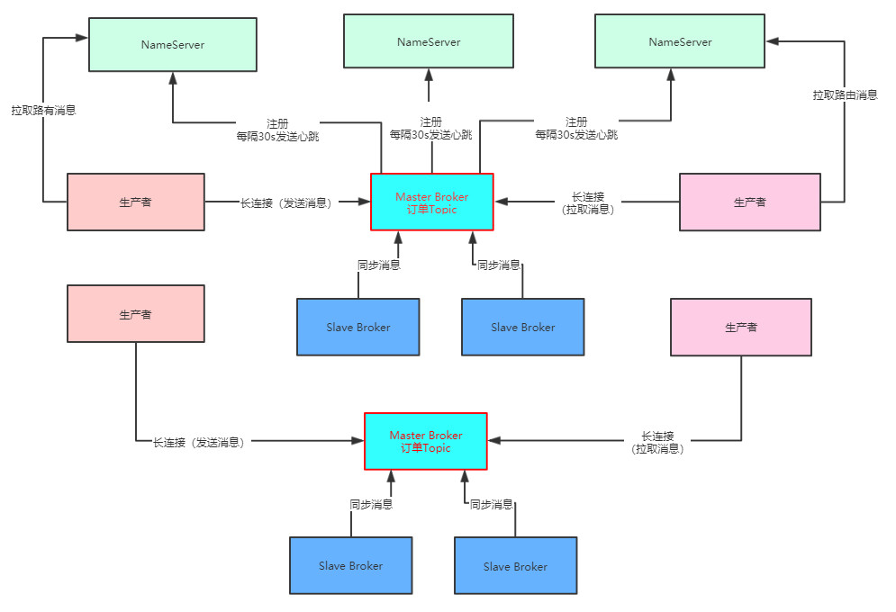

# 架构图

# 理解压测的含义和目的

其实如果对一个小规模的RocketMQ集群进行疯狂的压测，最后压测出来一个最大的极限TPS值，那只是压测中我们想要的一个结果而已，并不是实际中的最理想结果。

 什么意思呢？

假设我们现在对部署好的RocketMQ集群拼命进行压测，不停的增加生产者和消费者的机器以及线程数量，不停的增加RocketMQ集群的并发写入量和并发消费量，发现RocketMQ集群似乎可以抗下每秒10万+的消息量

那么你觉得在生产环境上，我们可以放心的让RocketMQ集群来抗这么高的TPS吗？

显然不是，因为我们在压测的时候一方面要关注RocketMQ能抗下多少TPS，一方面还要关注RocketMQ部署的几台机器的资源使用率和负载情况。

比如RocketMQ集群在抗下10万TPS（可以理解为每秒处理10万条消息）的同时，结果机器的CPU负载达到100%，内存几乎消耗殆尽，IO负载极高，网卡流量打满甚至快要打爆，此时你觉得这个10万TPS的成本是不是太高了？

因为眼看着你抗下了超高的TPS，结果自己机器资源消耗殆尽，几乎机器都快挂了，那么你在真正的生产环境能放心的允许RocketMQ集群抗到10万TPS吗？

显然是不行的，因为在机器快挂掉的情况下让中间件抗超高的负载是绝对不行的。

所以这种压测方法，仅仅能压测出来一个极限值而已。实际上我们平时做压测，主要关注的还是要压测出来一个最合适的最高负载。

什么叫最合适的最高负载呢？

 意思就是**在RocketMQ的TPS和机器的资源使用率和负载之间取得一个平衡。** 

比如RocketMQ集群在机器资源使用率极高的极端情况下可以扛到10万TPS，但是当他仅仅抗下8万TPS的时候，你会发现cpu负载、内存使用率、IO负载和网卡流量，都负载较高，但是可以接受，机器比较安全，不至于宕机。

那么这个8万TPS实际上就是最合适的一个最高负载，也就是说，哪怕生产环境中极端情况下，RocketMQ的TPS飙升到8万TPS，你知道机器资源也是大致可以抗下来的，不至于出现机器宕机的情况。

所以我们做压测，其实最主要的是综合TPS以及机器负载，尽量找到一个最高的TPS同时机器的各项负载在可承受范围之内，这才是压测的目的。

